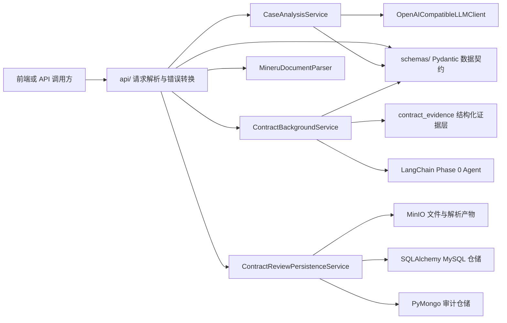

# `backend/app` 代码结构说明

本目录是 Legal AI Agent 的 FastAPI 应用包，包含 HTTP 接口、配置、请求/响应模型、业务服务、外部服务适配器和持久化代码。

当前对外业务入口有两条：

- `POST /api/v1/case-analyses`：案件材料分析。
- `POST /api/v1/contract-reviews`：合同 Phase 0 背景审查。

合同审查当前只处理背景卡、合同大类、关联文件状态、缺失问题和三个初步陷阱，不是完整法律风险审查。所有模型输出均只能作为参考，必须由法律专业人士复核。

## 1. 总体分层

| 层级 | 目录 | 主要职责 |
|---|---|---|
| 应用入口 | `main.py` | 创建 FastAPI 应用、配置日志、注册路由。 |
| HTTP/API 层 | `api/` | 解析请求、依赖注入、调用服务、转换错误响应。 |
| 配置层 | `core/` | 从环境变量和 `.env` 加载统一配置。 |
| 数据契约层 | `schemas/` | 定义 API 请求、响应和模型结构化输出的 Pydantic 模型。 |
| 业务层 | `services/` | 实现案件分析、合同背景审查、证据切段、MinerU 解析和持久化编排。 |
| 外部集成层 | `integrations/` | 封装 OpenAI-compatible LLM 客户端。 |
| 数据模型层 | `db/` | 定义 SQLAlchemy 模型、异步 MySQL 引擎和 Session Factory。 |
| 仓储层 | `repositories/` | 实现 MySQL 快照仓储和 MongoDB 审计仓储。 |

核心依赖关系如下：



## 2. 目录树

```text
app/
├── README.md
├── __init__.py
├── main.py
├── api/
│   ├── __init__.py
│   ├── health.py
│   └── v1/
│       ├── __init__.py
│       └── analysis.py
├── core/
│   ├── __init__.py
│   └── config.py
├── db/
│   ├── __init__.py
│   ├── models.py
│   └── session.py
├── integrations/
│   ├── __init__.py
│   └── llm/
│       ├── __init__.py
│       └── client.py
├── repositories/
│   ├── __init__.py
│   └── contract_review.py
├── schemas/
│   ├── __init__.py
│   ├── analysis.py
│   └── contract_background.py
└── services/
    ├── __init__.py
    ├── analysis_common.py
    ├── case_analysis.py
    ├── contract_background.py
    ├── contract_evidence.py
    ├── contract_review_persistence.py
    ├── document_parser.py
    ├── mineru_parser.py
    └── object_storage.py
```

各级 `__init__.py` 用于把目录声明为 Python 包，并通过模块文档字符串标明包的职责；当前没有集中重导出类或函数。

## 3. 应用入口

### `main.py`

FastAPI 应用入口。

- `configure_logging()`：配置全局日志格式和 `legal_ai` Logger 的 INFO 级别。
- `create_app()`：创建应用，设置标题、版本和描述，并注册健康检查与业务路由。
- `app`：Uvicorn 实际加载的 FastAPI 实例，启动路径为 `app.main:app`。

注册的路由来自：

- `app.api.health.router`
- `app.api.v1.analysis.router`

## 4. API 层：`api/`

API 层负责 HTTP 边界工作，不应放置核心法律分析逻辑。

### `api/health.py`

提供基础健康检查：

| 接口 | 作用 |
|---|---|
| `GET /health` | 返回后端进程可响应状态。 |
| `GET /health/dependencies` | 返回依赖服务的配置地址和模型名称。 |

`/health/dependencies` 当前只说明“已配置什么”，不会真实连接 MySQL、MongoDB、MinIO、Redis、Milvus、Neo4j 或模型服务，因此不能视为依赖服务存活探针。

### `api/v1/analysis.py`

当前主要业务路由和依赖装配模块，路由前缀为 `/api/v1`。

#### 依赖工厂

| 函数 | 作用 |
|---|---|
| `get_llm_client()` | 创建案件分析使用的 `OpenAICompatibleLLMClient`。 |
| `get_contract_background_service()` | 根据 LLM 配置创建合同背景审查服务和 LangChain Agent Runner。 |
| `get_document_parser()` | 根据 MinerU 配置创建文档解析器。 |
| `get_contract_review_persistence_service()` | 组装 MinIO、MySQL 和 MongoDB 适配器，创建合同审查持久化服务。 |

#### 请求解析辅助代码

| 名称 | 作用 |
|---|---|
| `ResolvedContractReviewContent` | 保存已解析的合同标题、Markdown、主文件、关联文件、关联文件名称和 MinerU 结果。 |
| `_resolve_content()` | 统一解析案件分析的 JSON 或 multipart 请求；multipart 主文件通过 MinerU 转成 Markdown。 |
| `_resolve_contract_review_content()` | 解析合同审查请求；multipart 模式额外保留原始文件字节、关联文件和完整 MinerU 结果。 |
| `_read_related_files()` | 读取 `related_files` 或 `related_file` 表单字段中的关联文件。 |
| `_provided_related_document_names()` | 合并关联文件名与表单声明的关联文档名称，并去重。 |
| `_error_response()` | 生成统一的 `{ "error": { "code": "...", "message": "..." } }` 错误响应。 |

#### 对外接口

| 接口 | 输入 | 处理过程 | 输出 |
|---|---|---|---|
| `POST /case-analyses` | JSON 文本，或 PDF/DOCX multipart 文件 | 文本解析后调用 `CaseAnalysisService` 和通用 LLM JSON 客户端 | `AnalysisResponse` |
| `POST /contract-reviews` | JSON 文本，或包含主合同及可选关联文件的 multipart 请求 | 主合同解析、证据切段、LangChain Agent、引用回填、持久化 | `ContractBackgroundResponse` |

需要注意：

- multipart 合同审查会解析主合同，但关联文件当前只登记名称并保存原件，不解析其内容。
- JSON 合同审查没有原始上传文件和 MinerU zip，但仍会保存段落、上下文快照和审计事件。
- 合同审查成功生成结果后才持久化；持久化失败会返回 `persistence_error`，不会把未保存结果作为成功响应返回。
- 案件分析当前不执行 MySQL、MongoDB 或 MinIO 持久化。

## 5. 配置层：`core/`

### `core/config.py`

`Settings` 继承 Pydantic Settings，集中声明运行配置：

| 配置类别 | 代表字段 | 当前用途 |
|---|---|---|
| 应用 | `app_env`、`api_host`、`api_port` | 应用环境和服务地址。 |
| LLM | `llm_base_url`、`llm_api_key`、`llm_model`、`llm_fallback_model` | 案件分析和合同背景审查。 |
| LangSmith | `langsmith_*` | 预留追踪配置；本目录代码没有主动写入环境变量或初始化客户端。 |
| MinerU | `mineru_api_key`、`mineru_base_url`、轮询间隔与超时 | 上传文档解析。 |
| MySQL | `mysql_*` | 合同任务、文档元数据、段落和快照。 |
| MongoDB | `mongodb_url` | Agent 事件、原始模型输出和 MinerU 批次审计。 |
| MinIO | `minio_*` | 原始文件、关联文件和 MinerU 产物。 |
| Redis、Neo4j、Milvus | `redis_url`、`neo4j_*`、`milvus_*` | 当前仅配置预留，业务代码尚未调用。 |
| Embedding、Reranker | `embedding_model`、`reranker_model` | 当前仅配置预留，Phase 0 未使用 RAG。 |

配置从根目录或 `backend/` 相对位置的 `.env` 加载。密码、密钥字段设置了 `repr=False`，减少对象被打印时泄露秘密的风险。

`get_settings()` 使用 `lru_cache`，同一进程通常复用一个配置对象。测试若修改环境变量，需要清理该函数缓存后重新读取。

## 6. Schema 层：`schemas/`

### `schemas/analysis.py`

定义案件分析的数据契约：

- `AnalysisModule`：当前只允许 `case_analysis`。
- `RiskLevel`：只允许 `low`、`medium`、`high`。
- `AnalysisRequest`：接收可选标题和文本内容，并去除首尾空白、拒绝空白内容。
- `AnalysisResponse`：返回模块名、摘要、风险等级、发现、建议和法律复核提示。

### `schemas/contract_background.py`

定义合同 Phase 0 的结构化模型：

| 模型 | 作用 |
|---|---|
| `SourceRef` | 服务层根据模型段落号回填的引用，包含稳定段落 ID、条款路径和完整段落原文。 |
| `EvidenceText` | 一项模型回答及其经过服务端校验的证据引用。 |
| `BackgroundCard` | 六项背景信息：商业目的、双方位置、相对方身份、金额期限范围、业务关注点、紧迫性。 |
| `RelatedDocument` | 固定关联文件类型及 `provided`/`missing` 状态。 |
| `ReviewPitfall` | 陷阱名称、风险说明、审查动作和证据引用。 |
| `ContractBackgroundAgentDraft` | LangChain Agent 必须生成的完整中间结构，包含六项回答、类别、摘要、十一类文件状态、缺失问题和三个陷阱。 |
| `ContractBackgroundResponse` | API 最终响应，引用原文由服务层根据模型段落号回填。 |

`BackgroundCard` 的校验器兼容旧版纯字符串输入，会把字符串转换成 `EvidenceText`；新代码应优先传递带 `source_refs` 的结构。

`ContractCategory` 定义了九类枚举，具体类别由结构化 Agent 基于本次证据判断。

## 7. LLM 集成层：`integrations/`

### `integrations/llm/client.py`

这是案件分析使用的 OpenAI-compatible JSON 客户端。

- `LLMConfigurationError`：缺少 API Key 等运行配置时抛出。
- `LLMClientError`：上游失败、模型无内容或 JSON 无法使用时抛出。
- `LLMClientProtocol`：业务服务依赖的最小异步接口，便于测试传入 fake client。
- `OpenAICompatibleLLMClient`：使用 `AsyncOpenAI` 请求主模型；失败后按顺序尝试 fallback 模型。
- `_parse_json_object()` / `_extract_json_object()`：处理纯 JSON、Markdown JSON 代码块或夹杂说明文字的模型响应，并保证结果是对象。

该客户端当前服务于 `CaseAnalysisService`。合同背景审查使用 `langchain_openai.ChatOpenAI` 和 LangChain Agent，但复用这里定义的统一错误类型。

## 8. 业务层：`services/`

### `services/analysis_common.py`

案件分析的公共规则：

- `LEGAL_DISCLAIMER`：统一法律专业人士复核提示。
- `LEGAL_ANALYSIS_SYSTEM_PROMPT`：约束模型只根据输入文本分析并输出 JSON。
- `build_analysis_response()`：把模型字典规范化为 `AnalysisResponse`。
- 私有规范化函数：为空字段提供受控默认值，并把非法风险等级降为 `medium`。

### `services/case_analysis.py`

案件分析服务。

- `CaseAnalysisService.analyze()`：调用 `LLMClientProtocol.complete_json()`，再构造受 Pydantic 校验的响应。
- `build_case_analysis_prompt()`：要求模型覆盖案情摘要、争议焦点、关键事实、证据、风险和下一步建议。

该模块只分析用户提供的材料，不执行法律检索、RAG、数据库查询或持久化。

### `services/document_parser.py`

只定义 `DocumentParseError`，作为所有文档解析失败的统一业务异常。API 层捕获后转换为 `document_parse_error`。

### `services/mineru_parser.py`

MinerU 文档解析适配器。

主要类型：

- `MineruParseResult`：保存 MinerU `batch_id`、完整 zip 字节和抽取后的 `full.md`。
- `DocumentParserProtocol`：上传文档解析器的最小协议，测试可替换为 fake parser。
- `MineruDocumentParser`：真实 MinerU HTTP 客户端。

解析流程：

1. 校验 `MINERU_API_KEY` 和上传文件内容。
2. 调用 `/api/v4/file-urls/batch` 获取批次 ID 与预签名上传地址。
3. 使用 HTTP PUT 上传原始文件。
4. 轮询 `/api/v4/extract-results/batch/{batch_id}`。
5. 下载 MinerU 返回的完整 zip。
6. 从 zip 中找到并解码 `full.md`。

所有网络错误、接口结构异常、解析失败、空文件、无 `full.md` 和超时都会转换成 `DocumentParseError`。默认 HTTP 客户端设置 `trust_env=False`，不会自动使用系统代理环境变量。

### `services/contract_evidence.py`

合同背景审查的结构化证据层。它只把 MinerU Markdown 转成可追溯证据、解析标题并保存上传文件名，不生成合同事实答案。

核心数据类型：

| 类型 | 作用 |
|---|---|
| `ContractSegment` | 单个标题、段落或表格行，带段落 ID、条款路径、字符位置和类型。 |
| `ContractEvidenceSnapshot` | 证据段、合同标题和本次实际上传关联文件名的结构快照。 |

核心函数：

| 函数 | 作用 |
|---|---|
| `segment_contract_markdown()` | 按 Markdown 块切段；把 HTML 表格拆成行；生成 `p0001` 格式的段落 ID。 |
| `build_contract_evidence_snapshot()` | 生成合同标题、证据段和实际上传关联文件名快照。 |
| `build_evidence_prompt()` | 把固定六问、三个陷阱、十一类文件、上传文件名和证据段转换为 Agent 输入。 |
| `resolve_source_refs()` | 验证模型段落号，去重并回填条款路径和完整段落原文。 |

结构处理目前包括：

- 识别中文条款标题并维护当前 `clause_path`。
- 把普通 Markdown 块和 HTML 表格行转换为稳定段落。
- 维护固定六问、三个陷阱和十一类关联文件目录。
- 保存本次实际上传且经过清理的关联文件名，供 Agent 判断状态。

段落 ID 在同一份解析文本和相同切段规则下稳定；如果原文或切段算法变化，ID 可能重新编号。

### `services/contract_background.py`

合同 Phase 0 核心编排服务。

主要组成：

| 名称 | 作用 |
|---|---|
| `ContractBackgroundAgentRunnerProtocol` | Agent Runner 的测试替换边界。 |
| `ContractBackgroundAnalysis` | 同时返回最终响应和原始结构化模型输出，便于审计持久化。 |
| `ContractBackgroundService` | 校验完整 Agent 输出，将段落号解析成最终引用并构造响应。 |
| `LangChainContractBackgroundAgentRunner` | 创建 `ChatOpenAI` 和 LangChain Agent，执行主模型/fallback 模型重试。 |

Agent 只能使用两个只读工具：

- `find_contract_excerpt(keyword)`：只在本次内存中的证据文本查找摘录。
- `list_phase0_related_document_types()`：返回固定 11 类关联文件名称。

这些工具不访问文件系统、数据库、网络或外部法律资料。

服务执行顺序：

1. 证据层建立 `ContractEvidenceSnapshot`。
2. 生成包含固定审查目录、上传文件名和全部证据段的 Prompt。
3. LangChain Agent 一次输出完整 `ContractBackgroundAgentDraft`，引用只填写段落号。
4. Pydantic 校验六项、三项和十一项必须完整；不合法时转换成 `LLMClientError`。
5. 服务层校验段落号、去重并回填完整段落原文。
6. 按固定顺序转换关联文件和陷阱，生成带法律复核提示的 `ContractBackgroundResponse`。

当前实现没有接入 RAG、向量检索、知识图谱、LangGraph 或 Deep Agents。

### `services/object_storage.py`

对象存储边界：

- `ObjectStorageProtocol`：声明异步 `put_bytes()` 接口。
- `MinioObjectStorage`：真实 MinIO 实现；桶不存在时创建桶，再上传字节内容。

MinIO Python SDK 是同步客户端，因此通过 `anyio.to_thread.run_sync()` 隔离阻塞调用，避免阻塞 FastAPI 事件循环。

### `services/contract_review_persistence.py`

合同审查持久化编排服务，把不同类型的数据交给对应存储适配器。

主要类型：

| 名称 | 作用 |
|---|---|
| `ContractReviewSourceFile` | 保存上传文件名、Content-Type 和原始字节。 |
| `ContractReviewSnapshotRepositoryProtocol` | MySQL 快照仓储协议。 |
| `ContractReviewAuditRepositoryProtocol` | MongoDB 审计仓储协议。 |
| `ContractReviewPersistenceService` | 协调 MinIO、MySQL 和 MongoDB 的写入顺序。 |
| `NoopContractReviewSnapshotRepository` / `NoopContractReviewAuditRepository` | 测试或显式依赖注入使用的空实现，不是生产运行时的故障 fallback。 |

`persist_review()` 当前执行：

1. 写入“持久化开始”审计事件。
2. 创建 MySQL 审查任务。
3. 把原始模型结构化输出写入 MongoDB 审计事件。
4. 把主合同与关联文件上传至 MinIO，并把文件元数据和 SHA-256 写入 MySQL。
5. 把 MinerU zip 与 `full.md` 上传至 MinIO，登记文档元数据与 MinerU 批次审计记录。
6. 重新使用证据切段规则，把 Markdown 段落写入 MySQL。
7. 写入合同背景快照。
8. 写入“持久化完成”审计事件。

当前 MySQL 上下文快照包含背景卡、合同大类、关联文件和陷阱；`summary`、`missing_questions`、`disclaimer` 与原始模型输出不在该快照字段中，其中原始模型输出单独存入 MongoDB 审计事件。

## 9. 数据库层：`db/`

### `db/models.py`

定义 SQLAlchemy 2.0 ORM 模型：

| 模型 / 表 | 作用 |
|---|---|
| `Base` | 所有 ORM 模型的声明式基类。 |
| `ReviewTask` / `review_task` | 合同审查任务 ID、标题、状态和时间。 |
| `ReviewDocument` / `review_document` | 主文件、关联文件和 MinerU 产物的元数据、哈希与 MinIO object key。 |
| `ContractParagraph` / `contract_paragraph` | 不可变证据段及其位置、类型和条款路径。 |
| `ContextSnapshot` / `context_snapshot` | Phase 0 背景卡、类别、关联文件、陷阱和完整快照 JSON。 |

数据库结构的实际创建与升级由 `backend/alembic/` 中的迁移负责，不应通过应用启动时自动建表。

### `db/session.py`

- `build_mysql_async_url()`：根据 `Settings` 构造 `mysql+aiomysql` URL，不把密码拼接到普通字符串中。
- `build_mysql_session_factory()`：创建或复用异步 Session Factory。
- `_cached_mysql_session_factory()`：最多缓存四组连接参数对应的引擎，启用 `pool_pre_ping`。
- `session_factory_engine()`：从 Session Factory 取出底层异步引擎，主要便于测试或生命周期管理。

## 10. 仓储层：`repositories/`

### `repositories/contract_review.py`

包含两个真实持久化适配器。

#### `SqlAlchemyContractReviewSnapshotRepository`

使用异步 SQLAlchemy Session 操作 MySQL：

- `create_task()`：创建或合并审查任务。
- `save_document()`：新增文件元数据。
- `save_paragraphs()`：先删除任务旧段落，再批量保存新段落。
- `save_context_snapshot()`：合并 Phase 0 快照并把任务状态更新为 `succeeded`。

#### `PymongoContractReviewAuditRepository`

使用 MongoDB 保存非强结构化审计信息：

- `contract_review_events`：持久化开始/完成、模型原始输出等事件。
- `contract_review_mineru_batches`：MinerU 批次 ID 和 MinIO object key。

PyMongo 是同步客户端，因此写入通过 `anyio.to_thread.run_sync()` 执行。

## 11. 两条主要调用链

### 案件分析

```text
POST /api/v1/case-analyses
  -> _resolve_content()
     -> JSON 直接校验文本
     -> multipart 通过 MinerU 提取 full.md
  -> CaseAnalysisService.analyze()
  -> OpenAICompatibleLLMClient.complete_json()
  -> build_analysis_response()
  -> AnalysisResponse
```

### 合同 Phase 0 背景审查

```text
POST /api/v1/contract-reviews
  -> _resolve_contract_review_content()
  -> MineruDocumentParser（multipart 主合同）
  -> build_contract_evidence_snapshot()
  -> LangChainContractBackgroundAgentRunner
  -> ContractBackgroundAgentDraft Pydantic 校验
  -> 校验段落号并回填完整证据原文
  -> ContractBackgroundResponse
  -> ContractReviewPersistenceService
     -> MinIO：文件与 MinerU 产物
     -> MySQL：任务、文档元数据、证据段、背景快照
     -> MongoDB：事件、模型原始输出、MinerU 批次
```

## 12. 对外错误格式

所有路由级受控错误使用：

```json
{
  "error": {
    "code": "error_code",
    "message": "面向用户的错误说明"
  }
}
```

主要错误码：

| HTTP 状态 | 错误码 | 场景 |
|---|---|---|
| 400 | `missing_file` | multipart 请求没有主文件。 |
| 400 | `invalid_json` | 请求体不是有效 JSON。 |
| 400 | `document_read_error` | 无法读取上传文件。 |
| 400 | `document_parse_error` | MinerU 或解析产物失败。 |
| 415 | `unsupported_media_type` | 不是 JSON 或 multipart。 |
| 422 | `validation_error` | Pydantic 请求校验失败。 |
| 422 | `missing_content` | JSON 请求缺少合同/案件正文。 |
| 502 | `llm_upstream_error` | 主模型和 fallback 模型都失败，或结构化输出不可用。 |
| 503 | `llm_configuration_error` | 模型 API Key 等配置缺失。 |
| 503 | `persistence_error` | MySQL、MongoDB 或 MinIO 持久化失败。 |

## 13. 当前存储职责

| 系统 | 当前实际保存内容 |
|---|---|
| MySQL | 合同审查任务、文件元数据、证据段、Phase 0 上下文快照。 |
| MongoDB | Agent/持久化事件、原始模型结构化输出、MinerU 批次记录。 |
| MinIO | 主合同原件、关联文件原件、MinerU `result.zip` 和 `full.md`。 |
| Redis | 本目录当前未使用。 |
| Milvus | 本目录当前未使用；Phase 0 无向量检索。 |
| Neo4j | 本目录当前未使用；Phase 0 无知识图谱查询。 |

MinIO object key 采用以下结构：

```text
contract-reviews/{task_id}/source/main/{filename}
contract-reviews/{task_id}/source/related/{filename}
contract-reviews/{task_id}/mineru/{batch_id}/result.zip
contract-reviews/{task_id}/mineru/{batch_id}/full.md
```

## 14. 修改和扩展建议

新增业务功能时，建议保持当前边界：

1. 在 `schemas/` 定义请求、响应和模型结构化输出。
2. 在 `services/` 编写可独立测试的业务逻辑。
3. 在 `integrations/` 封装新的外部 API 或模型 SDK。
4. 在 `repositories/` 封装数据库访问，不让路由直接执行查询。
5. 在 `api/v1/` 添加路由、依赖注入和受控错误转换。
6. 数据库结构变化同步添加 `backend/alembic/versions/` 迁移。
7. 在 `backend/tests/` 使用 fake/mock 外部依赖覆盖正常与失败路径。

法律输出必须继续保留专业法律人士复核提示。合同 Phase 0 若要扩展为完整审查、RAG 或知识图谱流程，应新增清晰的业务模块，不能把相关逻辑堆入现有路由函数。

## 15. 本地运行与验证

从项目根目录执行：

```powershell
cd backend
uv run uvicorn app.main:app --reload --host 127.0.0.1 --port 8000
```

代码检查与测试：

```powershell
cd backend
uv run ruff check .
uv run pytest
```

相关测试位于 `backend/tests/`：

- `test_health.py`：健康检查。
- `test_analysis_api.py`、`test_analysis_services.py`：案件分析。
- `test_contract_background_api.py`、`test_contract_background_service.py`：合同背景审查。
- `test_mineru_parser.py`：MinerU 请求、轮询、zip 与错误转换。
- `test_contract_review_persistence.py`：MinIO/MySQL/MongoDB 持久化编排边界。
