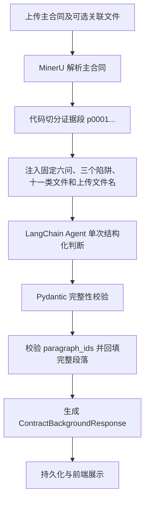

# 合同背景审查 Agent

## 1. 整体原则

合同背景审查 Agent 只负责 Phase 0，不输出完整法律风险结论。主合同通过 MinerU
解析成 Markdown 后，由代码切成带稳定段落号的证据段。固定六项基础问题、三个审查
陷阱和十一类关联文件由代码维护，但每次任务的答案和状态均由大模型基于本次材料判断。

模型输出只能作为参考，必须由法律专业人士复核。

## 2. 工作流

## 3. 代码层职责

- 解析主合同标题、普通段落和表格行，生成 `p0001` 格式段落号。
- 维护固定六项基础问题、三个审查陷阱和十一类关联文件目录。
- 清理并传递本次实际上传的关联文件名；关联文件正文当前不解析。
- 验证模型输出结构和段落号，去重后回填条款路径和完整段落原文。
- 对缺项、非法枚举和不存在的段落号返回受控错误，不生成语义 fallback。

代码层不再抽取主体、商业目的、金额期限、合同类别或关联文件状态。

## 4. Agent 输出

`ContractBackgroundAgentDraft` 必须一次返回：

- `summary` 和 `contract_category`。
- `background_card`：六项固定字段，每项为 `text + paragraph_ids`。
- `related_documents`：十一项固定状态字段，只允许 `provided` 或 `missing`。
- `pitfalls`：三个固定陷阱字段，每项包含风险、复核动作和段落号。
- `missing_questions`：当前材料无法可靠回答、需要用户补充的问题。

背景答案有内容时必须至少引用一个段落号；无法确认时返回 `text=null` 和空段落号。
模型不得返回原文摘录或条款路径。

## 5. 关联文件判断

只有本次实际上传且文件名能够明确对应某一固定类别时才标记 `provided`。主合同正文
仅提及某附件、文件名含糊或没有上传时均标记 `missing`。本期不解析关联文件正文，
关联文件状态也不展示段落引用。

## 6. 引用与持久化

- 服务层按模型返回的 `paragraph_ids` 查找 `ContractSegment`。
- 最终 `SourceRef` 包含段落号、条款路径和由代码回填的完整段落原文。
- MySQL 保存最终上下文快照和主合同段落；MongoDB 保存含 `paragraph_ids` 的模型原始输出。
- MinIO 保存主合同、关联文件原件和 MinerU 产物。
